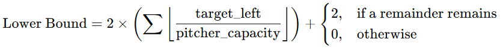

# Water Pitchers Problem using A* Algorithm

This project implements a solution to the Water Pitchers Problem using the A* search algorithm. The problem involves manipulating water between pitchers of different capacities to achieve a target volume in the infinite pitcher.

## Problem Description

Given:
- A set of pitchers with different capacities
- An infinite pitcher
- An infinite water source
- A target volume

Goal: Find the minimum number of steps required to measure the target volume using the given pitchers.

## Implementation

The solution uses the following components:

- [`main.py`](assignment_1/main.py): Contains the A* algorithm implementation
- [`utils.py`](assignment_1/utils.py): Helper functions for:
  - Reading input
  - Heuristic calculation
  - State expansion
  - Priority queue operations
- [`unit_tests.py`](assignment_1/unit_tests.py): Unit test cases

## Input Format

The input file (`input.txt`) should contain:

```sh
pitcher_1,pitcher_2,pitcher_3,... 
target_volume
```

Example:

```sh
2,3,5
4
```

## Lower Bound

How the heuristic works:
- It first determines how much more water is needed: `remaining = target - current`
- Then, it goes through the available finite pitchers (sorted from largest to smallest) and for each pitcher, it calculates how many times its full capacity can be used (using integer division). For each full usage, it adds 2 steps (one for filling and one for pouring).
- If there is still some water left after using all possible full uses of these pitchers, it adds an extra 2 steps for one more fill-pour operation.



*In summary, the lower bound is the minimum number of “fill and pour” operations (each costing 2 steps) needed to add the remaining water, assuming an ideal scenario.*

## Admissibility of the Heuristic

A heuristic is admissible if it **never** overestimates the actual cost to reach the goal from any state.

```bash
h(n) <= h*(n)
```

The heuristic used in this assignment is admissible. At no point does the function assume extra operations beyond the minimal necessary fills and pours. Even when there is some leftover water after using the finite pitchers, it only adds a minimal fixed cost (2 additional steps) to cover that remainder.

## Algorithm Details

The implementation uses:

- A* search with an admissible heuristic
- Priority queue for the open list
- Dictionary for the closed list (visited states)
- State generation through filling and pouring operations

## Running the Program

```bash
pyhton main.py
```

The program will output either:
- **"Number of steps: X** where X is the minimum steps required
- **"No solution found"** if the target is impossible to achieve

## Testing

Run the unit tests with:

```bash
python -m unittest unit_tests.py
```